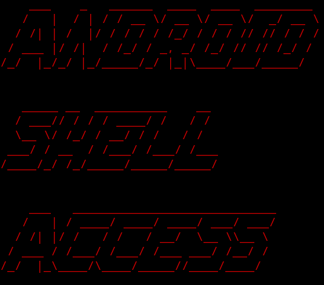

</img>
# Android Shell Access

# Run the shell.py in Android using Terminal Emulators made for Android with Python downloaded.

# Termux

* git clone https://github.com/areyoureadyyet/AndroidShellAccess

* chmod +x AndroidShellAccess

* cd AndroidShellAccess

* python shell.py

# PyDroid3

* Open Python Terminal

* python shell.py (make sure you're in the directory of this github repository's main directory downloaded)

# Author

# AreYouReadyYet
